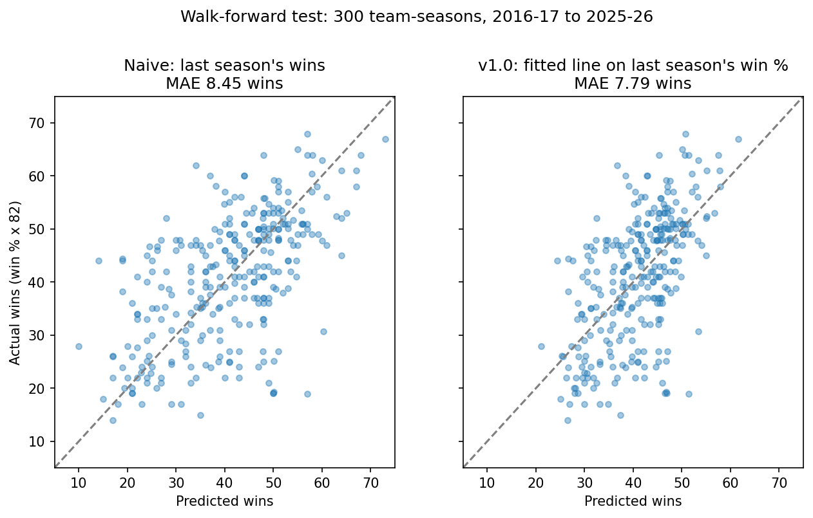
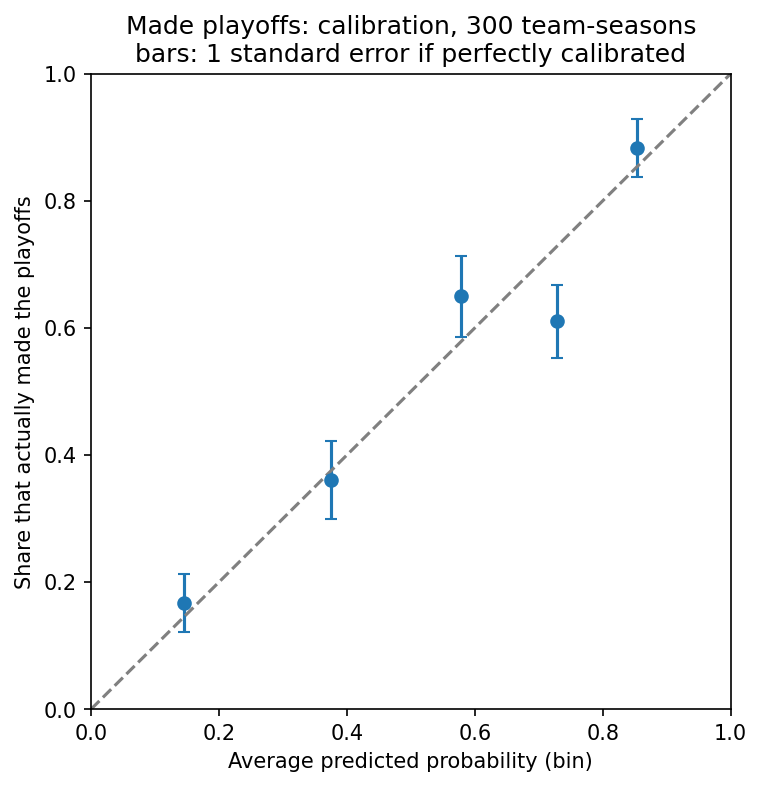
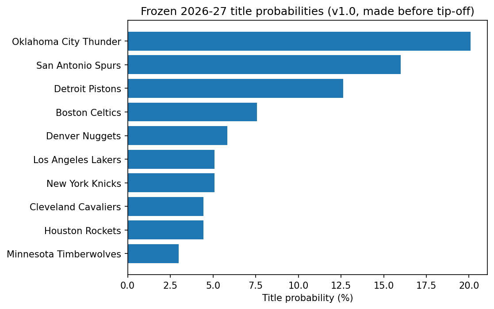

# NBA preseason forecasting: freeze first, score later

Forecasts every NBA team's regular-season wins, playoff odds and title odds **before the season starts**, publishes the forecast in this repository before the first game, and scores it against what actually happens. The project is built around one constraint: honest out-of-sample evaluation. No look-ahead, no random train/test splits, and probabilities judged on calibration rather than on whether the favorite won.

**Status:** the 2026-27 forecasts were frozen on October 3, 2026, before the season's October 21 tip-off. They have not been scored. Scoring happens after the season ends, and nothing below claims the model works on 2026-27, because that is not yet known.



## Results so far

All results below are walk-forward: each season is predicted using only earlier seasons. Test seasons are 2016-17 to 2025-26, 300 team-seasons. Wins are on an 82-game scale.

### Regular-season wins

| Model | MAE | RMSE | R-squared |
|---|---:|---:|---:|
| Everyone .500 | 10.00 | 12.02 | -0.00 |
| Naive: last season's win % | 8.45 | 10.99 | 0.16 |
| **v1.0: fitted line on last season's win %** | **7.79** | **9.79** | **0.34** |

- The fitted line beats the naive forecast in 9 of the 10 test seasons. The exception is 2023-24.
- The fitted slope is 0.604 (95% CI 0.550 to 0.658, standard errors clustered by team). About 40% of a team's distance from .500 disappears the following season, and the slope is far from 1 (t = -15). This describes a pattern, not its cause: it mixes luck in last year's record with real roster change.
- More inputs did not help. Net rating, an offense/defense split and four-factor statistics (raw or league-relative) scored MAE 7.69 to 7.75 and RMSE 9.73 to 9.83, which is not distinguishable from v1.0 on 300 rows. The simple model was kept.

### Playoff and title probabilities

Logistic regression on last season's win %, evaluated with the Brier score against a baseline that gives every team the same probability.

| Event | Events in test set | Brier | Constant-forecast Brier | Brier skill | AUC |
|---|---:|---:|---:|---:|---:|
| Made playoffs | 160 | 0.189 | 0.249 | 0.241 | 0.784 |
| Conference finals | 40 | 0.103 | 0.116 | 0.113 | 0.742 |
| Finals | 20 | 0.058 | 0.062 | 0.072 | 0.730 |
| Champion | 10 | 0.028 | 0.032 | 0.127 | 0.819 |

The playoff row rests on 160 events and is well supported. The champion row rests on 10 and is not: its standard error is large, and its higher skill than the Finals row should not be read as a real pattern.



## The frozen 2026-27 forecast

Made from 2025-26 results only. It does not know about the 2026 offseason, trades or injuries.

| Team | Predicted wins (80% interval) | Playoffs | Finals | Title |
|---|---|---:|---:|---:|
| Oklahoma City Thunder | 54.9 (42.4 to 66.4) | 92.5% | 28.0% | 20.1% |
| San Antonio Spurs | 53.7 (41.2 to 65.2) | 90.9% | 24.1% | 16.0% |
| Detroit Pistons | 52.5 (40.0 to 64.0) | 89.1% | 20.5% | 12.6% |
| Boston Celtics | 50.1 (37.6 to 61.6) | 84.4% | 14.5% | 7.6% |
| Denver Nuggets | 48.9 (36.4 to 60.4) | 81.5% | 12.1% | 5.8% |



- Files: [`predictions/2026_27_predictions_v1.0.csv`](predictions/2026_27_predictions_v1.0.csv) (wins) and [`predictions/2026_27_playoff_probabilities_v1.0.csv`](predictions/2026_27_playoff_probabilities_v1.0.csv) (playoffs, conference finals, Finals, title). Each records its creation time and model parameters. They are never edited after creation, and the scripts refuse to overwrite them.
- Commits: wins forecast in `aa41ee0`, playoff and title probabilities in `f0b77a4`.
- Intervals are the 10th and 90th percentiles of past walk-forward errors, about -12.5 to +11.6 wins around each prediction.
- Both a raw and a normalized version of each probability are frozen. Out-of-sample, the raw deeper-round probabilities summed to less than the bracket totals (3.80 vs. 4, 1.86 vs. 2, 0.91 vs. 1 per season on average), while for 2026-27 the raw Finals and title probabilities sum to more (2.18 and 1.13). The normalized version shifts every team's log-odds by one common amount so each event sums to the bracket total (16 / 4 / 2 / 1), which is known before the season. Normalized is the headline version, chosen on principle before seeing any results.

### How it will be scored

[`MARKET_PLAN.md`](MARKET_PLAN.md) fixes the model-vs-market comparison before the season: one named sportsbook, the last line before tip-off, MAE and RMSE on the same 30 teams, no switching books afterward. After the season, `python score_season.py 2026-27 v1.0` grades both forecast files. It refuses to run on a season that is not complete.

## Findings worth knowing

- **Regression to the mean is statistically real.** A team's record is skill plus luck, and the luck does not repeat.
- **The relationship looks stable across eras.** Slopes were 0.644 (2011-2015), 0.571 (2016-2020) and 0.594 (2021-2025), and a test that all three are equal gives p = 0.68. With 150 team-seasons per era this only detects large changes, so it is not proof of stability. Out-of-sample error was higher in 2021-2025 than 2016-2020 (fitted MAE 8.35 vs. 7.23 wins), about 1.6 standard errors, and I have not identified a cause.
- **League-wide scoring drifted, and it did not matter for forecasting.** The league-average offensive rating rose from about 106 (2010-11) to about 114 (2024-25), pace from about 93 to about 100, and eFG% from .499 to .543. Converting inputs to league-relative values did not change accuracy. The raw offense and defense coefficients came out equal and opposite (+0.019 and -0.019; test that they sum to zero, p = 0.89), so the shared drift cancels in the difference.
- **Multicollinearity in practice.** Win percentage and net rating correlate at 0.97. Including both gave a VIF of 14.6, inflated the win-percentage standard error from 0.038 to 0.144, and moved its coefficient from 0.604 to 0.219, while R-squared barely moved.
- **The biggest misses are collapses.** Seven of the eight largest out-of-sample misses are teams that finished far below their prediction, such as the 2019-20 Warriors (predicted 51.4 wins, finished at 18.9 on an 82-game scale). Last season's record cannot see roster or availability changes.
- **Titles are hard.** The ten champions in the test window were given between 0.2% and 47.4% beforehand.

## Method

- **No look-ahead by construction.** Columns prefixed `PREV_` come from the previous season and are the only allowed inputs. Columns prefixed `ACTUAL_` describe the season being predicted and are only ever targets. A test overwrites the target season's data and asserts that its inputs do not change; another confirms the leakage check fails on a deliberately bad dataset.
- **Walk-forward validation.** Each test season is predicted by a model fitted only on earlier seasons, with at least five training seasons.
- **Shortened seasons.** Targets are win percentage scaled to 82 games, because 2011-12, 2019-20 and 2020-21 had fewer games. 2019-20 also had unequal game counts across teams and is noisier.
- **Team identity** is joined on `TEAM_ID`, never on name (the Bobcats became the Hornets under the same ID).
- **Playoff results** come from the same API. Every series is best-of-7, so series won equals playoff wins divided by four, rounded down. Each season is checked to contain exactly 16 playoff teams and 8, 4, 2 and 1 teams that won at least one, two, three and four series.
- **Inference.** Regressions use team-clustered standard errors, because the same team appears every year.
- **Metrics** (MAE, RMSE, R-squared, Brier score, log loss) are implemented by hand and checked against hand calculations in the tests.

## Limitations

- v1.0 sees only last season's win percentage. It ignores the offseason, injuries and coaching changes.
- Roughly fifteen model variants were compared on the same 300 test rows, so the best-scoring one is optimistic and differences near 0.1 wins are not meaningful.
- The 80% intervals are estimated from the same errors they describe. Their out-of-sample coverage has not been checked.
- Ten test seasons of 30 teams is a small sample, and rows from the same team are not independent.
- Title probabilities rest on 15 champions in the full sample and 10 in the test window.
- The first real scoring will cover a single season of 30 teams, which cannot distinguish models that differ by small margins.

## Repository layout

```
collect_data.py          download regular-season team statistics (nba_api)
collect_playoffs.py      download playoff results, with a bracket integrity check
build_dataset.py         leakage-safe team-season dataset
predict_next_season.py   fit v1.0 and write the frozen wins forecast
predict_playoffs.py      fit the playoff models and write the frozen probabilities
score_season.py          grade a frozen forecast after the season
make_figures.py          regenerate the charts in this README
analysis/                league-relative features, playoff labels, era analysis
models/                  baselines, walk-forward validation, regressions, classification
tests/                   pytest suite
data/                    raw and processed data, market-line templates
predictions/             frozen forecasts (never overwritten)
figures/                 charts
MODEL_HISTORY.md         what each model version contains and how it scored
MARKET_PLAN.md           the model-vs-market comparison, fixed before the season
```

## Reproduce

Python 3.10 or later.

```
python -m venv .venv
source .venv/bin/activate
pip install -r requirements.txt

python collect_data.py
python collect_playoffs.py
python build_dataset.py
python -m analysis.playoffs
python -m models.walk_forward
python -m models.feature_models
python -m models.relative_features
python -m models.regression
python -m analysis.eras
python -m models.classification
python make_figures.py
python -m pytest
```

`predict_next_season.py` and `predict_playoffs.py` write the frozen forecasts once per season and model version.

## Annual update (currently manual)

1. After the season ends, raise `LAST_SEASON_START` in `collect_data.py` and re-run `collect_data.py`, `collect_playoffs.py` and `build_dataset.py`. The output file names still say 2010_2025 because they are hard-coded, but they will contain the new season.
2. Run `python score_season.py 2026-27 v1.0` and record the result in `MODEL_HISTORY.md`.
3. Before the next season, update the season constants in the two `predict_` scripts, run them, and commit and push before the first game. Any model change gets a new version and a new file; earlier forecasts are not touched.

## Planned

- Team payroll as a share of the salary cap, with two timing rules: same-season payroll for "does spending buy wins" and opening-night payroll for forecasting.
- Roster continuity and star availability, which is where the largest misses come from.
- The model-vs-market comparison in `MARKET_PLAN.md`, including implied probabilities and the bookmaker's margin.
- A SQLite store.

## Data and terms

Team statistics were retrieved from stats.nba.com through the unofficial `nba_api` package. The CSV files are included so the results can be reproduced. They remain subject to the NBA's terms of use, and this project is not affiliated with or endorsed by the NBA.

## Author

Yasin Latif, Economics, Princeton University. [LinkedIn](https://www.linkedin.com/in/yasinlatif)
